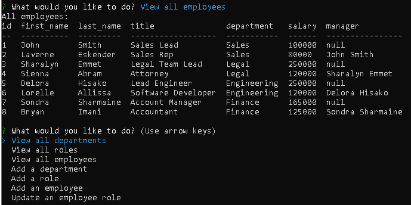

# Employee Tracker

## Description

This is a command line application that serves as a database for company employees. Employee names, job roles are tracked and can be added as needed.

Preview Images:

[Preview Video](https://drive.google.com/file/d/11vhBy6BqflLrnJESsRjPLSoaUkvqdXhP/view)

## Usage

From the command line enter 'npm start' to run the application. A menu with all available options is displayed.

Departments, roles, and employees can be viewed. Options to add to those categories are also available.

An individual employee's role can also be updated.

To quit press cntrl (windows)/cmd (mac) + C.

## Contributors

1. Weng Fei Fung - helped incorporate code for inquirer prompts and elucidate use of Database model.
